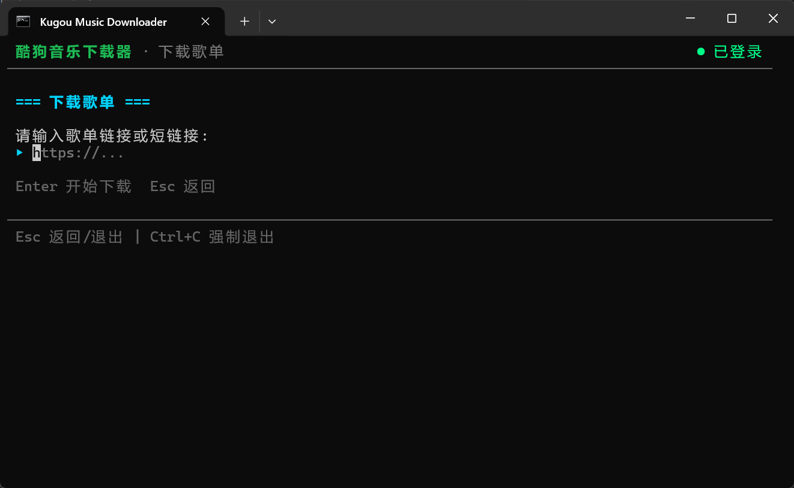
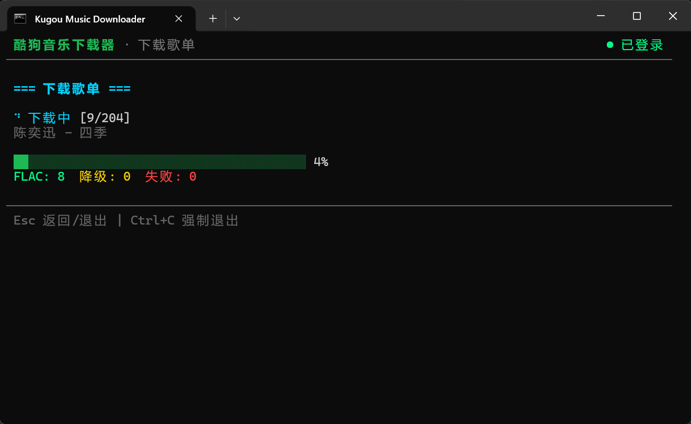
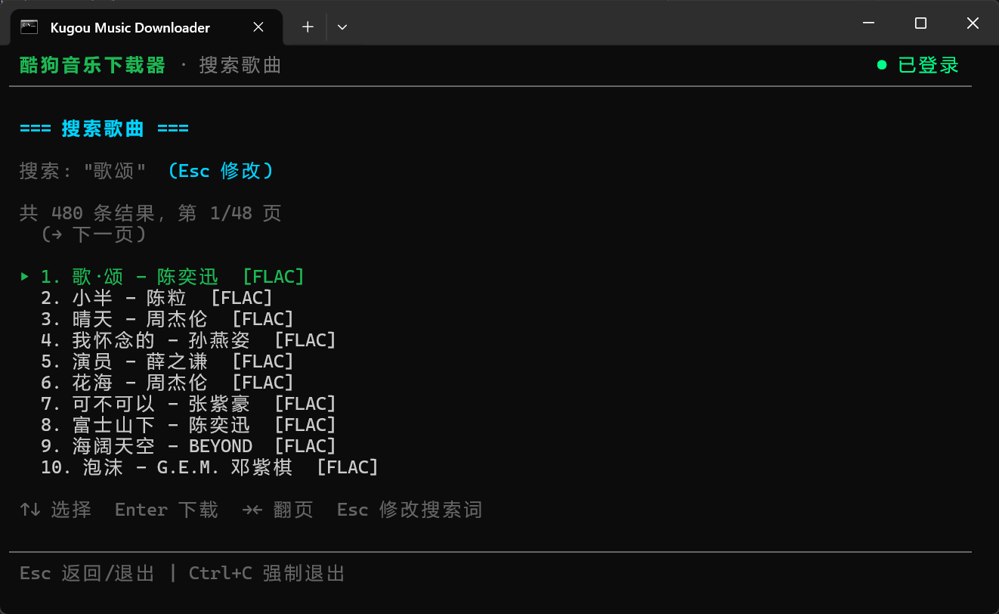

# Kugou Music Downloader

> ⚡ “免责”声明: 本项目为 100% Vibe Coding — 全程通过 AI Agent 对话生成，未手写一行代码。

酷狗音乐（概念版）下载器。基于 [KuGouMusicApi](https://github.com/MakcRe/KuGouMusicApi)，提供全终端 UI（TUI），支持歌单批量下载和单曲搜索下载。

## 免责声明

> 1. 本项目仅供学习使用，请尊重版权，请勿利用此项目从事商业行为及非法用途!
> 2. 使用本项目的过程中可能会产生版权数据。对于这些版权数据，本项目不拥有它们的所有权。为了避免侵权，使用者务必在 24 小时内清除使用本项目的过程中所产
>    生的版权数据。
> 3. 由于使用本项目产生的包括由于本协议或由于使用或无法使用本项目而引起的任何性质的任何直接、间接、特殊、偶然或结果性损害（包括但不限于因商誉损失、停
>    工、计算机故障或故障引起的损害赔偿，或任何及所有其他商业损害或损失）由使用者负责。
> 4. **禁止在违反当地法律法规的情况下使用本项目。** 对于使用者在明知或不知当地法律法规不允许的情况下使用本项目所造成的任何违法违规行为由使用者承担，本
>    项目不承担由此造成的任何直接、间接、特殊、偶然或结果性责任。
> 5. 音乐平台不易，请尊重版权，支持正版。
> 6. 本项目仅用于对技术可行性的探索及研究，不接受任何商业（包括但不限于广告等）合作及捐赠。
> 7. 如果官方音乐平台觉得本项目不妥，可联系本项目更改或移除。

## 功能

- **手机号登录** — 短信验证码登录，自动激活概念版 VIP
- **会话持久化** — session 保存到 `session.json`，下次自动恢复
- **歌单下载** — 短链接自动解析，批量下载全部歌曲，实时进度条
- **FLAC 优先** — 优先无损，无 FLAC 自动降级 320k MP3
- **歌曲搜索** — 关键词搜索，列表选择，方向键翻页
- **质量标识** — 结果标注 `[FLAC]` / `[HQ]` / `[320k]`
- **便携构建** — 一键打包为独立 .exe，无需 Node.js

## 运行截图





## 快速开始

### 开发运行（需 Node.js）

```bat
run.bat          rem 一键启动（自动 clone API + 安装依赖 + 运行）
run_js.bat       rem 仅运行（API 需手动启动）
```

### 便携构建（无需 Node.js）

```bat
build.bat        rem 构建独立 .exe，输出 kugou-download.zip
```

构建产物 `kugou-download.zip` 解压后包含：
```
├── download.exe   # TUI 下载器
├── api.exe        # API 服务器（自动启动）
└── public/        # 测试页面
```

解压到任意文件夹，双击 `download.exe` 即可使用。关闭窗口自动停止 API。

## 使用方法

### 键盘操作

| 按键 | 作用 |
|---|---|
| ↑↓ | 列表导航 |
| Enter | 确认 / 提交 |
| Esc | 返回上一级 |
| → | 搜索翻页（下一页） |
| ← | 搜索翻页（上一页） |
| Ctrl+C | 强制退出 |

### 下载策略

1. 请求 FLAC 无损 → 不可用则降级 320k MP3
2. 已存在的歌曲自动跳过（文件名匹配）
3. 歌单下载间隔 300ms，防止限流

## 项目结构

```
kugou-downloader/
├── download.js          # TUI 主程序（ink + htm）
├── lib/
│   ├── api.js           # 核心 API 模块
│   ├── yoga-shim.cjs    # yoga-layout CJS 兼容层
│   └── yoga-wasm.cjs    # WASM 加载器
├── scripts/
│   └── build.mjs        # 便携构建脚本
├── run.bat              # 一键启动
├── run_js.bat           # 仅运行脚本
├── build.bat            # 便携构建入口
├── KuGouMusicApi/       # API 代理（已 gitignore）
└── Downloads/           # 下载目录（已 gitignore）
```

## 注意事项

- **请勿频繁调整终端窗口大小** — ink 框架 resize 时可能出现渲染残留，重启即可
- 平台模式 `lite`（概念版），免费获得 VIP 权限
- 搜索需登录态，否则返回 `error_code: 152`

## 技术栈

| 层 | 技术 |
|---|---|
| TUI | [ink](https://github.com/vadimdemedes/ink) + [htm](https://github.com/developit/htm) |
| HTTP | axios |
| 构建 | esbuild + Node.js SEA |
| 运行时 | Node.js >= 18（开发）/ 内嵌 Node 25（便携版） |

## 许可证

MIT License · Copyright © 2026 Cyrilly

KuGouMusicApi 基于 MIT License · Copyright © 2024 MakcRe
